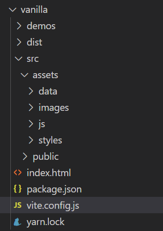
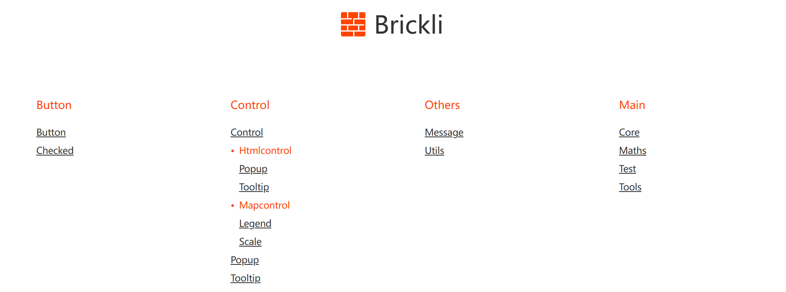

# Brickli

Brickli可以实现将自己常用的几类项目工程当作预设模板存入npm包，无论本地or异地，需要的时候就能通过控制台一键创建工程。

# 安装
```
npm install brickli
```

# 使用
```
brickli create
```
- 选择需要创建的工程模板，目前vanilla/react/wasm/webgl可选

- 填入必要信息

- 自行按需进行其他修改

# 模板介绍
## vanilla
用于前端基础开发(HTML-CSS-JS)，基于vite构建工程
```
	"devDependencies": {
		"vite": "^4.1.4",
		"vite-plugin-ejs": "^1.6.4"
	},
```
### 工程目录

### 测试页面

### 打包
## react
## wasm
## webgl